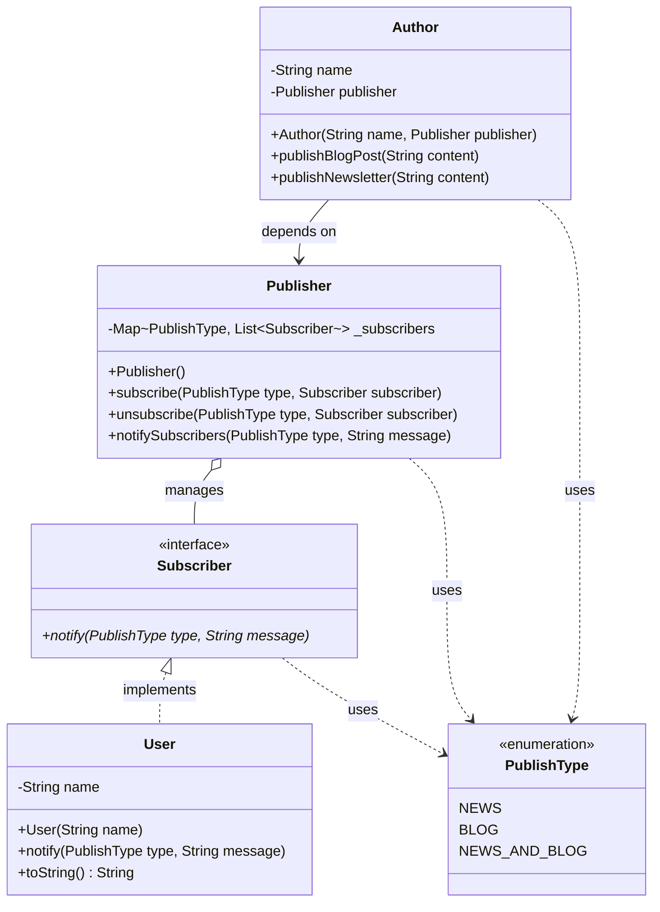
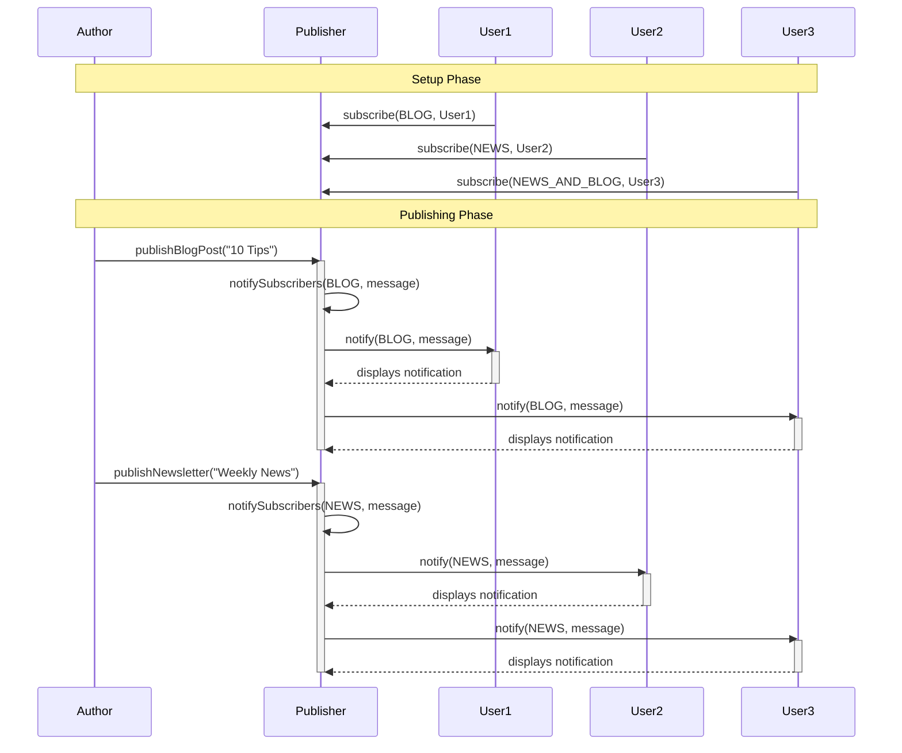

# Observer Pattern Summary

## What is the Observer Pattern?
The Observer pattern is a behavioral design pattern that defines a one-to-many dependency between objects. When one object (the Subject) changes state, all its dependents (Observers) are notified and updated automatically. It decouples the Subject from its Observers, allowing dynamic subscription and notification.

## When to Use?
- When multiple objects need to react to changes in another object.
- When you want to decouple the object that changes (Subject) from the objects that react (Observers).
- When you need a dynamic subscription mechanism (observers can be added/removed at runtime).
- Common in event-driven systems, GUIs, and notification systems.

## Why Use It?
- Promotes loose coupling between Subject and Observers.
- Supports dynamic relationships and runtime flexibility.
- Makes it easy to add new observers without changing the Subject.

## Pros
- **Loose Coupling:** Subject and Observers are independent.
- **Scalability:** Any number of observers can subscribe/unsubscribe.
- **Extensibility:** Easy to add new observer types.
- **Reusability:** Observers and Subjects can be reused in different contexts.

## Cons
- **Potential Performance Issues:** Notifying many observers can be slow.
- **Complexity:** Can lead to complex dependencies if not managed carefully.
- **Memory Leaks:** If observers are not unsubscribed properly, can cause memory issues.
- **Order of Notification:** Observers are notified in an unspecified order.

## Applications in Flutter

- **State Management:** Flutter's ValueNotifier, ChangeNotifier, and Stream are based on the Observer pattern. Widgets listen to changes and rebuild automatically.
- **Provider Package:** Uses ChangeNotifier to notify listeners (widgets) when data changes.
- **Animation:** AnimationController notifies listeners about animation state changes.
- **Event Handling:** Streams and StreamBuilder allow widgets to react to asynchronous events.
- **Form Validation:** Listeners can be attached to form fields to react to user input changes.

## Real World/Life Example

- **Social Media Notifications:** When a user follows another, they become a subscriber. When the followed user posts new content, all followers (observers) receive a notification.
- **Weather Station:** A weather station (subject) updates its measurements. Multiple display devices (observers) receive updates and show the latest weather.
- **Stock Market:** Investors (observers) subscribe to stock price updates. When prices change, all subscribed investors are notified.
- **Newsletters:** Users subscribe to newsletters. When a new edition is published, all subscribers receive it automatically.

## Relationship with Other Patterns
- **Mediator:** Observer distributes communication from one to many; Mediator centralizes communication among many objects.
- **Event Bus / Publish-Subscribe:** Observer is a simpler, direct version; Event Bus is more generic and decoupled.
- **MVC (Model-View-Controller):** Views act as observers to the Model.
- **Command:** Can be used together; Observer notifies, Command executes actions.
- **Strategy:** Observer notifies, Strategy changes behavior.

# UML Class Diagram - Observer Pattern Implementation

## Mermaid Class Diagram (Alternative Format)



## ASCII Class Diagram

```
┌─────────────────────────┐
│   <<enumeration>>       │
│     PublishType         │
├─────────────────────────┤
│ + NEWS                  │
│ + BLOG                  │
│ + NEWS_AND_BLOG         │
└─────────────────────────┘
            ▲
            │ uses
            │
┌───────────┴─────────────┐
│   <<interface>>          │
│      Subscriber          │
├──────────────────────────┤
│ + notify(type, message)  │
└──────────────────────────┘
            ▲
            │ implements
            │
┌───────────┴──────────────┐
│         User             │
├──────────────────────────┤
│ - name: String           │
├──────────────────────────┤
│ + User(name)             │
│ + notify(type, message)  │
│ + toString(): String     │
└──────────────────────────┘
            ▲
            │ manages (1 to many)
            │
┌───────────┴────────────────────────────────┐
│            Publisher                       │
├────────────────────────────────────────────┤
│ - _subscribers: Map<Type, List<Subscriber>>│
├────────────────────────────────────────────┤
│ + Publisher()                              │
│ + subscribe(type, subscriber): void        │
│ + unsubscribe(type, subscriber): void      │
│ + notifySubscribers(type, message): void   │
└────────────────────────────────────────────┘
            ▲
            │ depends on
            │
┌───────────┴──────────────┐
│        Author            │
├──────────────────────────┤
│ - name: String           │
│ - publisher: Publisher   │
├──────────────────────────┤
│ + Author(name, pub)      │
│ + publishBlogPost(cont)  │
│ + publishNewsletter(cont)│
└──────────────────────────┘
```

## Relationships Explained

### 1. **Subscriber ◄─┤ User** (Implementation/Realization)
- User **implements** Subscriber interface
- User must provide concrete implementation of `notify()` method

### 2. **Publisher ◄──◊ Subscriber** (Aggregation)
- Publisher **aggregates** multiple Subscribers
- Publisher maintains a Map of Lists of Subscribers
- Relationship: 1 Publisher manages many Subscribers
- Multiplicity: 1 to * (one-to-many)

### 3. **Author ──► Publisher** (Association/Dependency)
- Author **depends on** Publisher
- Author has a reference to Publisher
- Author uses Publisher to send notifications

### 4. **All Classes ┄► PublishType** (Dependency)
- Multiple classes **use** the PublishType enum
- Dotted line indicates usage/dependency

## Pattern Roles

| Pattern Role          | Class Name  | Responsibility                          |
|----------------------|-------------|-----------------------------------------|
| **Subject**          | Publisher   | Maintains observers, sends notifications|
| **Observer**         | Subscriber  | Interface for receiving notifications   |
| **Concrete Observer**| User        | Actual observer that handles updates    |
| **Client/Creator**   | Author      | Triggers notifications through Subject  |

## Sequence Diagram - Publishing Flow



## Object Diagram Example

```
┌──────────────────┐
│  ahmed: Author   │
│  name = "Ahmed"  │
└────────┬─────────┘
         │ publisher
         ▼
┌─────────────────────────────┐
│    publisher: Publisher     │
│ _subscribers:               │
│   BLOG → [ali, john]        │
│   NEWS → [mohamed]          │
│   NEWS_AND_BLOG → [sara]    │
└─────────────────────────────┘
         │ notifies
         ▼
┌─────────────────┐  ┌─────────────────┐  ┌─────────────────┐
│   ali: User     │  │ mohamed: User   │  │  sara: User     │
│ name = "Ali"    │  │ name="Mohamed"  │  │ name = "Sara"   │
└─────────────────┘  └─────────────────┘  └─────────────────┘
```

## Design Pattern Principles Applied

### ✅ **Open/Closed Principle**
- Open for extension: Can add new Subscriber types without modifying Publisher
- Closed for modification: Publisher code doesn't change when new observers are added

### ✅ **Dependency Inversion Principle**
- Publisher depends on Subscriber abstraction, not concrete User class
- High-level modules don't depend on low-level modules

### ✅ **Single Responsibility Principle**
- Publisher: Manages subscriptions and notifications
- User: Handles notification display
- Author: Creates content and triggers publishing
- Each class has one reason to change

### ✅ **Interface Segregation**
- Subscriber interface is minimal with only one method
- Clients aren't forced to depend on methods they don't use

## Key Features

1. **One-to-Many Relationship**: One Publisher notifies many Subscribers
2. **Loose Coupling**: Author doesn't know about User, only Publisher
3. **Dynamic Subscription**: Subscribers can be added/removed at runtime
4. **Type-Based Filtering**: Subscribers only get notifications they want
5. **Smart Notification**: NEWS_AND_BLOG subscribers get both types