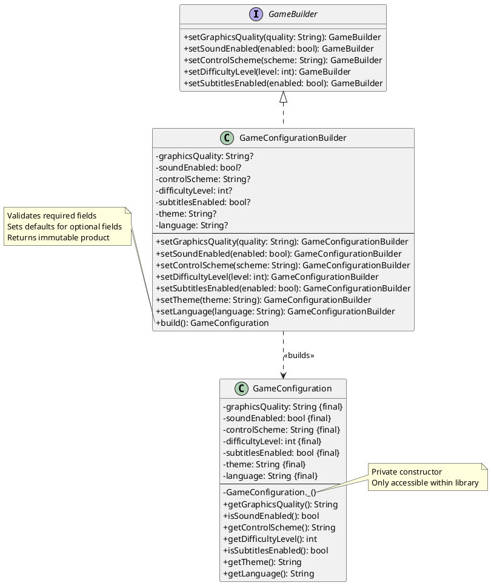

# 🏗️ Builder Pattern - Game Configuration Example

[](https://refactoring.guru/design-patterns/builder)
[](https://refactoring.guru/design-patterns/creational-patterns)
[](https://dart.dev)

> **Separate the construction of a complex object from its representation so that the same construction process can create different representations.**

---

## 📋 Table of Contents

- [Overview](#-overview)
- [Problem](#-problem)
- [Solution](#-solution)
- [Structure](#-structure)
- [Implementation Details](#-implementation-details)
- [Usage Examples](#-usage-examples)
- [When to Use](#-when-to-use)
- [Pros and Cons](#-pros-and-cons)
- [Real-World Examples](#-real-world-examples)
- [Flutter Applications](#-flutter-applications)
- [Comparison with Other Patterns](#-comparison-with-other-patterns)
- [UML Diagram](#-uml-diagram)
- [Builder Pattern with Director (Advanced)](#-builder-pattern-with-director-advanced)
- [Key Takeaways](#-key-takeaways)
- [Questions & Answers](#-questions--answers)

---

## 🎯 Overview

The **Builder Pattern** is a creational design pattern that lets you construct complex objects step by step. The pattern allows you to produce different types and representations of an object using the same construction code.

This example demonstrates building a `GameConfiguration` object with multiple settings (graphics quality, sound, controls, difficulty, theme, language) using a fluent, chainable API that enforces immutability and validation.

---

## ❌ Problem

### The Challenge

Imagine you need to create a game configuration object with many parameters:

```dart
// ❌ BAD: Constructor with too many parameters (telescoping constructor anti-pattern)
GameConfiguration config = GameConfiguration(
  'High',      // What is this?
  true,        // What does true mean?
  'Gamepad',   // Easy to mix up order
  3,           // Magic number
  true,        // Another boolean - which setting?
  'Dark',      // Theme
  'English'    // Language
);
```

**Problems with this approach:**
- 🤔 **Unclear**: Hard to remember parameter order
- 🐛 **Error-prone**: Easy to mix up arguments
- 🔒 **No validation**: Invalid values can be passed
- 📝 **Not readable**: Code is hard to understand
- 🔄 **Not flexible**: Adding optional parameters breaks existing code
- 🚫 **No defaults**: Must provide all values even if you want defaults

---

## ✅ Solution

### The Builder Pattern Approach

```dart
// ✅ GOOD: Fluent, readable, validated construction
GameConfiguration config = GameConfigurationBuilder()
    .setGraphicsQuality('High')
    .setSoundEnabled(true)
    .setControlScheme('Gamepad')
    .setDifficultyLevel(3)
    .setSubtitlesEnabled(true)
    .setTheme('Dark')
    .setLanguage('English')
    .build();  // Creates immutable, validated object
```

**Benefits of this approach:**
- ✨ **Clear and readable**: Method names explain what each parameter does
- 🔗 **Fluent API**: Method chaining provides natural flow
- ✅ **Validated**: `build()` ensures all required fields are set
- 🎯 **Defaults**: Optional fields get sensible defaults automatically
- 🔒 **Immutable**: Final product cannot be modified after creation
- 🛡️ **Encapsulated**: Clients cannot bypass validation with direct constructor calls

---

## 📁 Structure

### Files in this Example

```
builder/
├── game_configuration.dart          # Library file (Product + Builder API)
├── game_configuration_builder.dart  # Builder implementation (part)
├── game_builder.dart                # Abstract builder interface
├── main.dart                        # Usage example
└── README.md                        # This file
```

### Component Responsibilities

| Component | Responsibility |
|-----------|---------------|
| **GameConfiguration** | Immutable product with `final` fields and private constructor |
| **GameBuilder** | Abstract interface defining builder methods |
| **GameConfigurationBuilder** | Concrete builder with validation, defaults, and fluent API |
| **Library (game_configuration_lib)** | Groups product and builder to enforce private constructor |

---

## 🔧 Implementation Details

### 1️⃣ Private Constructor Pattern

The key insight: **clients cannot create `GameConfiguration` directly**.

```dart
// game_configuration.dart
library game_configuration_lib;

part 'game_configuration_builder.dart';

class GameConfiguration {
  final String graphicsQuality;
  final bool soundEnabled;
  // ... other fields
  
  // Private constructor - only code in this library can call it
  GameConfiguration._(GameConfigurationBuilder builder)
      : graphicsQuality = builder.getGraphicsQuality!,
        soundEnabled = builder.isSoundEnabled!,
        //other params;
}
```

**Why this works:**
- The underscore (`_`) makes the constructor private to the library
- Builder is a `part` of the same library, so it can call `GameConfiguration._()`
- Client code is outside the library, so it **cannot** call the private constructor
- This forces clients to use the builder and call `.build()`

### 2️⃣ Builder with Validation

```dart
// game_configuration_builder.dart (part of library)
part of game_configuration_lib;

class GameConfigurationBuilder implements GameBuilder {
  String? graphicsQuality;  // Nullable to detect missing values
  bool? soundEnabled;
  // ... other nullable fields
  
  GameConfiguration build() {
    // availability to add validation here ...
    // Validate required fields
    if (graphicsQuality == null) {
      throw StateError('graphicsQuality is required.');
    }
    if (soundEnabled == null) {
      throw StateError('soundEnabled is required.');
    }
    
    // Provide defaults for optional fields
    subtitlesEnabled ??= false;
    theme ??= 'Default';
    language ??= 'English';

    return GameConfiguration._(this);
  }
}
```

### 3️⃣ Fluent Interface

Each setter returns `this` to enable method chaining:

```dart
@override
GameConfigurationBuilder setGraphicsQuality(String quality) {
  this.graphicsQuality = quality;
  return this;  // Enable chaining
}
```

---

## 💻 Usage Examples

### Basic Usage

```dart
import 'package:design_patterns_course/creational/builder/game_configuration.dart';

void main() {
  // Build a custom configuration
  GameConfiguration config = GameConfigurationBuilder()
      .setGraphicsQuality('High')
      .setSoundEnabled(true)
      .setControlScheme('Gamepad')
      .setDifficultyLevel(3)
      .setSubtitlesEnabled(true)
      .setTheme('Dark')
      .setLanguage('English')
      .build();

  print('Graphics: ${config.getGraphicsQuality()}');
  print('Sound: ${config.isSoundEnabled()}');
}
```

### With Defaults

```dart
// Only set required fields, optional fields get defaults
GameConfiguration minimalConfig = GameConfigurationBuilder()
    .setGraphicsQuality('Medium')
    .setSoundEnabled(true)
    .setControlScheme('Keyboard')
    .setDifficultyLevel(2)
    .build();  // theme='Default', language='English', subtitles=false
```

### Error Handling

```dart
try {
  // Missing required fields
  GameConfiguration invalid = GameConfigurationBuilder()
      .setGraphicsQuality('High')
      // Missing other required fields
      .build();
} catch (e) {
  print('Build failed: $e');
  // Output: StateError: soundEnabled is required. Call setSoundEnabled(...) before build().
}
```

---

## 🎯 When to Use

### ✅ Use Builder Pattern When:

1. **Complex Construction**: Object has many parameters (5+)
2. **Optional Parameters**: Many optional fields with defaults
3. **Immutability Required**: You want to create immutable objects
4. **Step-by-Step Construction**: Construction logic is complex or needs validation
5. **Readable Code**: You want self-documenting, fluent API
6. **Multiple Representations**: Same construction process can create different variants

### ❌ Don't Use Builder When:

1. **Simple Objects**: Object has 2-3 parameters (use constructor with named parameters)
2. **No Validation Needed**: Simple data classes without constraints
3. **Performance Critical**: Builder adds small overhead (negligible in most cases)
4. **Frequently Modified**: Objects need to be mutable after creation

---

## ⚖️ Pros and Cons

### Advantages ✅

| Benefit | Description |
|---------|-------------|
| **Readability** | Self-documenting code with clear method names |
| **Flexibility** | Add optional parameters without breaking existing code |
| **Validation** | Centralized validation logic in `build()` method |
| **Immutability** | Produces immutable objects (thread-safe, fewer bugs) |
| **Defaults** | Sensible defaults for optional parameters |
| **Encapsulation** | Private constructor prevents invalid object states |
| **Testability** | Easy to create test objects with specific configurations |

### Disadvantages ❌

| Drawback | Description |
|----------|-------------|
| **Boilerplate** | More code (builder class + interface) |
| **Complexity** | Overkill for simple objects |
| **Learning Curve** | New developers need to understand the pattern |
| **Memory** | Builder object exists temporarily (usually negligible) |

---

## 🌍 Real-World Examples

### 1. Game Settings
```dart
// Player saves custom settings
GameConfiguration playerConfig = GameConfigurationBuilder()
    .setGraphicsQuality('Ultra')
    .setSoundEnabled(true)
    .setControlScheme('Gamepad')
    .setDifficultyLevel(5)  // Hard mode
    .setSubtitlesEnabled(true)
    .setTheme('Cyberpunk')
    .setLanguage('Spanish')
    .build();
```

### 2. Device-Specific Profiles
```dart
// Mobile device with limited resources
GameConfiguration mobileConfig = GameConfigurationBuilder()
    .setGraphicsQuality('Low')
    .setSoundEnabled(false)  // Save battery
    .setControlScheme('Touch')
    .setDifficultyLevel(2)
    .build();

// High-end desktop
GameConfiguration desktopConfig = GameConfigurationBuilder()
    .setGraphicsQuality('Ultra')
    .setSoundEnabled(true)
    .setControlScheme('Keyboard')
    .setDifficultyLevel(4)
    .build();
```

### 3. User Onboarding
```dart
// First-time user gets beginner-friendly defaults
GameConfiguration beginnerConfig = GameConfigurationBuilder()
    .setGraphicsQuality('Medium')
    .setSoundEnabled(true)
    .setControlScheme('Touch')
    .setDifficultyLevel(1)  // Easy mode
    .setSubtitlesEnabled(true)  // Help new players
    .build();
```

---

## 📱 Flutter Applications

### Use Case 1: Theme Configuration

```dart
// Build a complex theme object
AppTheme theme = AppThemeBuilder()
    .setPrimaryColor(Colors.blue)
    .setSecondaryColor(Colors.orange)
    .setFontFamily('Roboto')
    .setDarkMode(true)
    .setAnimationDuration(Duration(milliseconds: 300))
    .build();
```

### Use Case 2: HTTP Request Builder

```dart
// Build API requests with optional parameters
HttpRequest request = HttpRequestBuilder()
    .setUrl('https://api.example.com/users')
    .setMethod('POST')
    .addHeader('Authorization', 'Bearer token123')
    .addQueryParam('page', '1')
    .setBody(jsonEncode({'name': 'John'}))
    .setTimeout(Duration(seconds: 30))
    .build();
```

### Use Case 3: Form Validation Configuration

```dart
// Configure complex form validators
FormValidator validator = FormValidatorBuilder()
    .setMinLength(8)
    .setMaxLength(50)
    .requireUppercase(true)
    .requireNumber(true)
    .requireSpecialChar(true)
    .setCustomValidator((value) => /* custom logic */)
    .build();
```

### Use Case 4: Provider/Bloc Configuration

```dart
// Initialize app state with builder
void main() {
  final config = GameConfigurationBuilder()
      .setGraphicsQuality('High')
      .setSoundEnabled(true)
      .setControlScheme('Touch')
      .setDifficultyLevel(3)
      .build();
  
  runApp(
    Provider<GameConfiguration>.value(
      value: config,
      child: MyApp(),
    ),
  );
}
```

---

## 🔄 Comparison with Other Patterns

### Builder vs Factory Method

| Aspect | Builder | Factory Method |
|--------|---------|----------------|
| **Purpose** | Construct complex objects step-by-step | Create objects without specifying exact class |
| **Complexity** | Many parameters, optional fields | Simple object creation |
| **API** | Fluent, chainable methods | Single factory method call |
| **Use When** | Complex configuration needed | Need polymorphism or subclass selection |

### Builder vs Abstract Factory

| Aspect | Builder | Abstract Factory |
|--------|---------|------------------|
| **Focus** | Single complex object | Family of related objects |
| **Construction** | Step-by-step | All at once |
| **Representation** | Can vary final product | Fixed product structure |
| **Example** | Build game config | Create UI theme (buttons, text, colors together) |

### Builder vs Prototype

| Aspect | Builder | Prototype |
|--------|---------|-----------|
| **Creation Method** | Construct from parameters | Clone existing object |
| **Flexibility** | Highly configurable | Copy with minor tweaks |
| **Use When** | Many configurations | Expensive initialization, need copies |

### Builder vs Constructor with Named Parameters (Dart-specific)

```dart
// Named parameters (simple objects)
class SimpleConfig {
  final String name;
  final int age;
  
  SimpleConfig({required this.name, this.age = 18});
}

// Builder (complex objects with validation)
GameConfiguration complexConfig = GameConfigurationBuilder()
    .setGraphicsQuality('High')
    // ... 7+ parameters with validation
    .build();
```

**Use named parameters when:**
- Object has 2-4 parameters
- No complex validation needed
- Defaults are simple

**Use Builder when:**
- Object has 5+ parameters
- Complex validation logic
- Step-by-step construction makes sense
- You need to enforce immutability strictly

---

## 📊 UML Diagram

```
┌─────────────────────────────────────────────────────────────┐
│                     <<interface>>                           │
│                       GameBuilder                           │
├─────────────────────────────────────────────────────────────┤
│ + setGraphicsQuality(String): GameBuilder                   │
│ + setSoundEnabled(bool): GameBuilder                        │
│ + setControlScheme(String): GameBuilder                     │
│ + setDifficultyLevel(int): GameBuilder                      │
│ + setSubtitlesEnabled(bool): GameBuilder                    │
└─────────────────────────────────────────────────────────────┘
                              △
                              │ implements
                              │
┌─────────────────────────────────────────────────────────────┐
│              GameConfigurationBuilder                       │
├─────────────────────────────────────────────────────────────┤
│ - graphicsQuality: String?                                  │
│ - soundEnabled: bool?                                       │
│ - controlScheme: String?                                    │
│ - difficultyLevel: int?                                     │
│ - subtitlesEnabled: bool?                                   │
│ - theme: String?                                            │
│ - language: String?                                         │
├─────────────────────────────────────────────────────────────┤
│ + setGraphicsQuality(String): GameConfigurationBuilder      │
│ + setSoundEnabled(bool): GameConfigurationBuilder           │
│ + setControlScheme(String): GameConfigurationBuilder        │
│ + setDifficultyLevel(int): GameConfigurationBuilder         │
│ + setSubtitlesEnabled(bool): GameConfigurationBuilder       │
│ + setTheme(String): GameConfigurationBuilder                │
│ + setLanguage(String): GameConfigurationBuilder             │
│ + build(): GameConfiguration                                │
└─────────────────────────────────────────────────────────────┘
                              │
                              │ builds
                              ▼
┌─────────────────────────────────────────────────────────────┐
│                   GameConfiguration                         │
├─────────────────────────────────────────────────────────────┤
│ - graphicsQuality: String (final)                           │
│ - soundEnabled: bool (final)                                │
│ - controlScheme: String (final)                             │
│ - difficultyLevel: int (final)                              │
│ - subtitlesEnabled: bool (final)                            │
│ - theme: String (final)                                     │
│ - language: String (final)                                  │
├─────────────────────────────────────────────────────────────┤
│ - GameConfiguration._({...}) [private constructor]          │
│ + getGraphicsQuality(): String                              │
│ + isSoundEnabled(): bool                                    │
│ + getControlScheme(): String                                │
│ + getDifficultyLevel(): int                                 │
│ + isSubtitlesEnabled(): bool                                │
│ + getTheme(): String                                        │
│ + getLanguage(): String                                     │
└─────────────────────────────────────────────────────────────┘
```

### PlantUML Code



---

## 🎬 Builder Pattern with Director (Advanced)

### What is the Director?

The **Director** is an optional component in the classic GoF Builder pattern that **orchestrates the building process**. It encapsulates complex construction sequences and provides standard configurations.

### Components Structure

```
┌──────────────┐         ┌──────────────┐
│   Director   │────────>│   Builder    │
└──────────────┘         └──────────────┘
                                │
                                │ builds
                                ▼
                         ┌──────────────┐
                         │   Product    │
                         └──────────────┘
```

### File Structure (with Director)

```
builder/
├── exercise_with_director/
│   ├── game_configuration.dart          # Product (library)
│   ├── game_configuration_builder.dart  # Builder (part)
│   ├── game_configuration_director.dart # Director ⭐ NEW
│   ├── game_builder.dart                # Builder interface
│   └── main.dart                        # Usage example
```

### Code Example

**Director Implementation:**

```dart
class GameConfigurationDirector {
  /// Build mobile configuration
  GameConfiguration buildMobileConfig(GameConfigurationBuilder builder) {
    return builder
        .setGraphicsQuality('Low')
        .setSoundEnabled(false)
        .setControlScheme('Touch')
        .setDifficultyLevel(2)
        .setSubtitlesEnabled(true)
        .setTheme('Light')
        .setLanguage('English')
        .build();
  }
  
  /// Build desktop configuration
  GameConfiguration buildDesktopConfig(GameConfigurationBuilder builder) {
    return builder
        .setGraphicsQuality('Ultra')
        .setSoundEnabled(true)
        .setControlScheme('Keyboard')
        .setDifficultyLevel(4)
        .setSubtitlesEnabled(false)
        .setTheme('Dark')
        .setLanguage('English')
        .build();
  }
  
  /// Build console configuration
  GameConfiguration buildConsoleConfig(GameConfigurationBuilder builder) {
    return builder
        .setGraphicsQuality('High')
        .setSoundEnabled(true)
        .setControlScheme('Gamepad')
        .setDifficultyLevel(3)
        .build();
  }
}
```

**Usage:**

```dart
// #director: Create director
final director = GameConfigurationDirector();

// #builder: Reusable builder instance
final builder = GameConfigurationBuilder();

// Use director for standard configs
final mobileConfig = director.buildMobileConfig(builder);
print('Mobile - Graphics: ${mobileConfig.getGraphicsQuality()}');

// Reset and reuse builder
builder.reset();
final desktopConfig = director.buildDesktopConfig(builder);
print('Desktop - Graphics: ${desktopConfig.getGraphicsQuality()}');

// Still can build manually without director
final customConfig = GameConfigurationBuilder()
    .setGraphicsQuality('Custom')
    .setSoundEnabled(true)
    .setControlScheme('VR')
    .setDifficultyLevel(5)
    .build();
```

### Benefits of Using Director

| Benefit | Description |
|---------|-------------|
| **Encapsulation** | Hides complex construction logic from clients |
| **Reusability** | Director methods can be reused across the application |
| **DRY Principle** | Avoid duplicating common construction sequences |
| **Consistency** | Ensures standard configurations are built the same way |
| **Builder Reuse** | Can reset and reuse the same builder instance |
| **Guidance** | Provides templates for clients who don't know "how" to build |

### When to Use Director

#### ✅ Use Director When:

1. **Multiple Standard Configurations** exist
   - Mobile, Desktop, Console presets
   - Beginner, Intermediate, Expert levels
   - Development, Staging, Production environments

2. **Complex Construction Logic** that shouldn't be duplicated
   - Multi-step setup with dependencies
   - Conditional field settings
   - Calculations or transformations during build

3. **Client Guidance Needed**
   - New developers don't know optimal configurations
   - Domain-specific presets (Medical, Gaming, Finance)
   - Best-practice configurations

4. **Builder Reuse** is beneficial
   - Same builder used for multiple configurations
   - Performance optimization (reduce object creation)

#### ❌ Skip Director When:

1. **Simple Builder** with straightforward usage
   - Only 1-2 standard configurations
   - Construction is self-explanatory

2. **Always Custom Configurations**
   - Clients always build unique objects
   - No common patterns exist

3. **Preset Builders Sufficient**
   - Named constructors handle common cases
   - Example: `PresetGameConfigurationBuilder.lowSpec()`

### Director vs Preset Builders

| Aspect | Director | Preset Builders |
|--------|----------|-----------------|
| **Approach** | Orchestrates external builder | Pre-configured builder instance |
| **Flexibility** | Can work with any builder | Tied to specific builder |
| **Reusability** | Reuses same builder instance | New builder per preset |
| **Complexity** | Additional class | Extends existing builder |
| **Use Case** | Many complex presets | Few simple presets |

**Director Example:**
```dart
var director = GameConfigurationDirector();
var config = director.buildMobileConfig(GameConfigurationBuilder());
```

**Preset Builder Example:**
```dart
var config = PresetGameConfigurationBuilder.lowSpec().build();
```

### Advanced Director Patterns

#### 1. Director with Validation

```dart
class GameConfigurationDirector {
  GameConfiguration buildForDevice(String deviceType, GameConfigurationBuilder builder) {
    switch (deviceType.toLowerCase()) {
      case 'mobile':
        return buildMobileConfig(builder);
      case 'desktop':
        return buildDesktopConfig(builder);
      case 'console':
        return buildConsoleConfig(builder);
      default:
        throw ArgumentError('Unknown device type: $deviceType');
    }
  }
}
```

#### 2. Director with Callbacks

```dart
class GameConfigurationDirector {
  GameConfiguration buildCustom(
    GameConfigurationBuilder builder,
    void Function(GameConfigurationBuilder) customize,
  ) {
    // Apply base configuration
    builder
        .setGraphicsQuality('Medium')
        .setSoundEnabled(true)
        .setDifficultyLevel(3);
    
    // Allow client to customize
    customize(builder);
    
    return builder.build();
  }
}

// Usage
var config = director.buildCustom(builder, (b) {
  b.setLanguage('Spanish');
  b.setTheme('Cyberpunk');
});
```

#### 3. Director with Progressive Enhancement

```dart
class GameConfigurationDirector {
  /// Start with mobile, then enhance for desktop
  GameConfiguration buildProgressive(GameConfigurationBuilder builder) {
    // Base mobile config
    buildMobileConfig(builder);
    
    // Don't call build yet! Enhance it
    return builder
        .setGraphicsQuality('Ultra')  // Override
        .setSoundEnabled(true)         // Override
        .build();  // Now build
  }
}
```

### UML Diagram (with Director)

```
┌─────────────────────────────────────────────┐
│        GameConfigurationDirector            │
├─────────────────────────────────────────────┤
│ + buildMobileConfig(builder): GameConfig    │
│ + buildDesktopConfig(builder): GameConfig   │
│ + buildConsoleConfig(builder): GameConfig   │
│ + buildBeginnerConfig(builder): GameConfig  │
│ + buildCompetitiveConfig(builder): GameConfig│
└─────────────────────────────────────────────┘
                    │
                    │ uses
                    ▼
┌─────────────────────────────────────────────┐
│      GameConfigurationBuilder               │
├─────────────────────────────────────────────┤
│ + setGraphicsQuality(String): Builder       │
│ + setSoundEnabled(bool): Builder            │
│ + setControlScheme(String): Builder         │
│ + setDifficultyLevel(int): Builder          │
│ + build(): GameConfiguration                │
│ + reset(): void                             │
└───────────────────────────────────────────���─┘
                    │
                    │ builds
                    ▼
┌─────────────────────────────────────────────┐
│          GameConfiguration                  │
├─────────────────────────────────────────────┤
│ - graphicsQuality: String (final)           │
│ - soundEnabled: bool (final)                │
│ - controlScheme: String (final)             │
│ + getGraphicsQuality(): String              │
└─────────────────────────────────────────────┘
```

### Real-World Director Examples

#### Example 1: Environment-Based Configuration

```dart
class EnvironmentDirector {
  GameConfiguration buildForEnvironment(String env, GameConfigurationBuilder builder) {
    switch (env) {
      case 'development':
        return builder
            .setGraphicsQuality('Low')      // Fast iteration
            .setSoundEnabled(false)         // Less distraction
            .setDifficultyLevel(1)          // Easy testing
            .build();
      
      case 'staging':
        return builder
            .setGraphicsQuality('Medium')   // Test performance
            .setSoundEnabled(true)          // Full experience
            .setDifficultyLevel(3)          // Realistic difficulty
            .build();
      
      case 'production':
        return builder
            .setGraphicsQuality('High')     // Best experience
            .setSoundEnabled(true)
            .setDifficultyLevel(3)
            .build();
      
      default:
        throw ArgumentError('Unknown environment: $env');
    }
  }
}
```

#### Example 2: User-Profile-Based Configuration

```dart
class UserProfileDirector {
  GameConfiguration buildForUserProfile(UserProfile profile, GameConfigurationBuilder builder) {
    // Base configuration for all users
    builder
        .setLanguage(profile.preferredLanguage)
        .setTheme(profile.theme);
    
    // Adjust based on user level
    if (profile.isNewUser) {
      return builder
          .setDifficultyLevel(1)
          .setSubtitlesEnabled(true)
          .setGraphicsQuality('Medium')
          .build();
    } else if (profile.isPro) {
      return builder
          .setDifficultyLevel(5)
          .setSubtitlesEnabled(false)
          .setGraphicsQuality('Ultra')
          .build();
    } else {
      return builder
          .setDifficultyLevel(3)
          .setGraphicsQuality('High')
          .build();
    }
  }
}
```

#### Example 3: Accessibility Director

```dart
class AccessibilityDirector {
  GameConfiguration buildAccessible(
    GameConfigurationBuilder builder, {
    bool visualImpairment = false,
    bool hearingImpairment = false,
    bool motorImpairment = false,
  }) {
    // Base accessible config
    builder
        .setDifficultyLevel(1)
        .setTheme('Light');
    
    // Adjust for specific needs
    if (visualImpairment) {
      builder
          .setGraphicsQuality('Low')      // Less visual noise
          .setSoundEnabled(true);         // Rely on audio cues
    }
    
    if (hearingImpairment) {
      builder.setSubtitlesEnabled(true);  // Always show text
    }
    
    if (motorImpairment) {
      builder.setControlScheme('Touch');  // Easier than keyboard
    }
    
    return builder.build();
  }
}
```

### Director Best Practices

1. **Keep Director Methods Focused**
   - Each method should build one complete, coherent configuration
   - Don't create overly generic methods that do too much

2. **Accept Builder as Parameter**
   - Allows client to reuse the same builder instance
   - Enables builder reset and reuse pattern

3. **Return the Product, Not the Builder**
   - Director should call `build()` and return the immutable product
   - Clients get a ready-to-use configuration

4. **Document the Intent**
   - Each director method should clearly document what configuration it builds
   - Explain why certain values are chosen

5. **Combine with Strategy Pattern**
   - Use different directors for different contexts
   - Example: `MobileDirector`, `DesktopDirector`, `ConsoleDirector`

### Summary: Builder vs Builder+Director

| Feature | Builder Only | Builder + Director |
|---------|--------------|-------------------|
| **Client Control** | Full control over each field | Guided presets + manual override |
| **Complexity** | Client must know all fields | Director encapsulates knowledge |
| **Flexibility** | Maximum flexibility | Balanced (presets + customization) |
| **Code Duplication** | Possible if presets repeated | Eliminated via director methods |
| **Learning Curve** | Must learn all builder methods | Can use presets immediately |
| **Best For** | Always unique configs | Mix of standard + custom configs |

### Quick Reference

```dart
// ❌ Without Director (clients duplicate code)
var mobile1 = GameConfigurationBuilder()
    .setGraphicsQuality('Low')
    .setSoundEnabled(false)
    .setControlScheme('Touch')
    .build();

var mobile2 = GameConfigurationBuilder()
    .setGraphicsQuality('Low')
    .setSoundEnabled(false)
    .setControlScheme('Touch')
    .build();  // Duplicated!

// ✅ With Director (DRY principle)
var director = GameConfigurationDirector();
var mobile1 = director.buildMobileConfig(GameConfigurationBuilder());
var mobile2 = director.buildMobileConfig(GameConfigurationBuilder());

// ✅ Still allows customization
builder.reset();
director.buildMobileConfig(builder);  // Don't call build yet!
var customMobile = builder
    .setLanguage('French')  // Override one field
    .build();  // Now build
```

---

## 💡 Key Takeaways

### Core Concepts

1. **Private Constructor + Library Parts** = Forced Builder Usage
   - `GameConfiguration._()` is private
   - Builder is `part of` the same library, so it can call the constructor
   - Clients must use builder and call `.build()`

2. **Validation at Build Time**
   - Required fields checked in `build()`
   - Defaults provided for optional fields
   - Guarantees valid, immutable product

3. **Fluent API**
   - Each setter returns `this`
   - Enables natural, readable method chaining
   - Self-documenting code

### Design Principles Applied

- ✅ **Single Responsibility**: Builder handles construction, Product represents data
- ✅ **Open/Closed**: Easy to add new optional parameters without breaking clients
- ✅ **Liskov Substitution**: Builder implements interface consistently
- ✅ **Interface Segregation**: `GameBuilder` defines core methods
- ✅ **Dependency Inversion**: Depend on `GameBuilder` interface, not concrete builder

### Dart-Specific Techniques

- **Library Privacy**: Use `library` + `part` + `part of` for private constructors
- **Nullable Fields**: Use `String?` in builder to detect missing values
- **Named Parameters**: Use in private constructor for clarity
- **Non-null Assertion**: Safe to use `!` after validation in `build()`

---

## 📚 Further Reading

- [Refactoring.Guru - Builder Pattern](https://refactoring.guru/design-patterns/builder)
- [Gang of Four - Design Patterns Book](https://en.wikipedia.org/wiki/Design_Patterns)
- [Effective Dart - Design Guide](https://dart.dev/guides/language/effective-dart/design)
- [Flutter Architecture Patterns](https://docs.flutter.dev/development/data-and-backend/state-mgmt/options)

---

## 🤝 Contributing

Ideas for enhancements:
- ✅ **Director Pattern** - See `exercise_with_director/` for complete example
- Add preset builders (e.g., `PresetGameConfigurationBuilder.highPerformance()`)
- Add unit tests for validation logic
- Add JSON serialization support
- Create builder from existing configuration (copy/modify pattern)
- Add validation for field value ranges (e.g., difficultyLevel 1-5)
- Implement async build() for configurations that require async initialization

---

## 📝 Questions & Answers

### Q1: Why doesn't Dart support nested classes like Java?

**A:** Dart was designed with simplicity and clarity in mind. The language designers made deliberate choices:

**1. Flat Namespace Philosophy**
- Dart encourages flat, simple structures
- Nested classes create deep hierarchies that are harder to navigate and understand
- Simpler mental model for developers

**2. Library-Level Privacy**
- Dart uses libraries (files) as the unit of encapsulation, not classes
- Privacy is achieved via underscore (`_`) prefix at the library level
- This is cleaner than Java's package-private, protected, and nested class complexity

**3. Import Simplicity**
```dart
// Java - Complex nested imports
import com.example.Outer.Inner;
import com.example.Outer.Inner.DeepNested;

// Dart - Simple flat imports
import 'package:example/outer.dart';
import 'package:example/inner.dart';
```

**4. Better Tooling & IDE Support**
- Flat structures are easier for static analysis tools
- Autocomplete and refactoring work better
- Code navigation is simpler

**5. Avoid Common Anti-patterns**
- Nested classes are often misused, creating tight coupling
- Dart learned from Java's complexity
- Forces better separation of concerns

**Java Builder Pattern (with nested class):**
```java
public class GameConfiguration {
    private String quality;
    
    private GameConfiguration(Builder builder) {
        this.quality = builder.quality;
    }
    
    public static class Builder {  // Nested static class
        private String quality;
        
        public Builder setQuality(String quality) {
            this.quality = quality;
            return this;
        }
        
        public GameConfiguration build() {
            return new GameConfiguration(this);
        }
    }
}

// Usage
GameConfiguration config = new GameConfiguration.Builder()
    .setQuality("High")
    .build();
```

**Dart Equivalent (library + part):**
```dart
// game_configuration.dart
library game_configuration_lib;
part 'game_configuration_builder.dart';

class GameConfiguration {
  final String quality;
  GameConfiguration._(this.quality);  // Private constructor
}

// game_configuration_builder.dart
part of game_configuration_lib;

class GameConfigurationBuilder {
  String? quality;
  
  GameConfigurationBuilder setQuality(String quality) {
    this.quality = quality;
    return this;
  }
  
  GameConfiguration build() => GameConfiguration._(quality!);
}

// Usage (same as Java!)
GameConfiguration config = GameConfigurationBuilder()
    .setQuality("High")
    .build();
```

**Key Takeaway:** Dart achieves the same encapsulation goal using `library` + `part`, which is more aligned with Dart's philosophy of simplicity.

---

### Q2: Why not use named parameters in Dart instead of Builder?

**A:** Named parameters work great for simple objects (2-4 parameters). Use Builder when:

**Use Named Parameters (Simple Case):**
```dart
class User {
  final String name;
  final int age;
  final String email;
  
  User({required this.name, this.age = 18, required this.email});
}

// Usage - clear and simple
var user = User(name: 'John', email: 'john@example.com');
```

✅ Good for 2-4 parameters  
✅ Simple defaults  
✅ No complex validation  

**Use Builder (Complex Case):**
```dart
GameConfiguration config = GameConfigurationBuilder()
    .setGraphicsQuality('High')
    .setSoundEnabled(true)
    .setControlScheme('Gamepad')
    .setDifficultyLevel(3)
    .setSubtitlesEnabled(true)
    .setTheme('Dark')
    .setLanguage('English')
    .build();
```

✅ Good for 5+ parameters  
✅ Complex validation logic  
✅ Interdependent fields (if A is set, B is required)  
✅ Step-by-step construction  
✅ Multiple construction variants  

---

### Q3: Why use `part` files instead of separate classes?

**A:** To enforce the private constructor pattern and prevent clients from bypassing validation:

**Without `part` (Problem):**
```dart
// game_configuration.dart
class GameConfiguration {
  GameConfiguration._();  // Private to THIS FILE only
}

// game_configuration_builder.dart (separate file)
class GameConfigurationBuilder {
  GameConfiguration build() {
    return GameConfiguration._();  // ❌ ERROR: Can't access private constructor
  }
}
```

**With `part` (Solution):**
```dart
// game_configuration.dart
library game_configuration_lib;
part 'game_configuration_builder.dart';

class GameConfiguration {
  GameConfiguration._();  // Private to LIBRARY
}

// game_configuration_builder.dart
part of game_configuration_lib;

class GameConfigurationBuilder {
  GameConfiguration build() {
    return GameConfiguration._();  // ✅ OK: Same library
  }
}
```

**Benefits:**
- Builder can access private constructor (it's in the same library)
- Clients CANNOT access private constructor (they're outside the library)
- Forced to use builder pattern correctly

---

### Q4: Can I modify the GameConfiguration after build()?

**A:** No! All fields are `final`. The object is immutable. To "modify", create a new instance:

```dart
// Original configuration
GameConfiguration original = GameConfigurationBuilder()
    .setGraphicsQuality('High')
    .setSoundEnabled(true)
    .build();

// ❌ Cannot do this - fields are final
original.graphicsQuality = 'Low';  // ERROR: Can't assign to final field

// ✅ Create new configuration with changes
GameConfiguration updated = GameConfigurationBuilder()
    .setGraphicsQuality('Low')  // Changed
    .setSoundEnabled(original.isSoundEnabled())  // Copy from original
    .setControlScheme(original.getControlScheme())  // Copy
    .setDifficultyLevel(original.getDifficultyLevel())  // Copy
    .build();
```

**Why immutability?**
- Thread-safe (no race conditions)
- Predictable behavior (no surprise mutations)
- Easier to reason about (once created, never changes)
- Cache-friendly (can safely reuse references)

---

### Q5: What happens if I forget to call build()?

**A:** You'll have a `GameConfigurationBuilder` object, not a `GameConfiguration`:

```dart
// ❌ Wrong - forgot to call build()
var config = GameConfigurationBuilder()
    .setGraphicsQuality('High')
    .setSoundEnabled(true);

// config is a GameConfigurationBuilder, not GameConfiguration!
print(config.getGraphicsQuality());  // ❌ ERROR: Method doesn't exist on builder

// ✅ Correct - must call build()
GameConfiguration config = GameConfigurationBuilder()
    .setGraphicsQuality('High')
    .setSoundEnabled(true)
    .build();  // Returns immutable GameConfiguration

print(config.getGraphicsQuality());  // ✅ OK: 'High'
```

**Why this design?**
- Builder has NO public getters (only setters)
- Forces you to call `.build()` to get the product
- Enforces the correct usage pattern

---

### Q6: Why make all builder fields nullable?

**A:** To detect missing required fields at build time with clear error messages:

```dart
class GameConfigurationBuilder {
  String? graphicsQuality;  // Nullable
  bool? soundEnabled;       // Nullable
  
  GameConfiguration build() {
    if (graphicsQuality == null) {
      throw StateError('graphicsQuality is required! Call setGraphicsQuality() first.');
    }
    if (soundEnabled == null) {
      throw StateError('soundEnabled is required! Call setSoundEnabled() first.');
    }
    // ... validation passes, construct object
    return GameConfiguration._(
      graphicsQuality: graphicsQuality!,  // Safe to use ! here
      soundEnabled: soundEnabled!,
    );
  }
}
```

**Alternatives and why nullable is better:**

| Approach | Problem |
|----------|---------|
| `late String quality;` | Runtime error with unclear message if not initialized |
| `String quality = 'Default';` | Can't distinguish "not set" from "set to default" |
| `String? quality;` | ✅ Explicit validation with helpful error messages |

---

### Q7: Can we chain the build() method?

**A:** No, and that's intentional! `build()` returns the immutable product, not the builder:

```dart
// ❌ WRONG - Cannot chain after build()
var config = GameConfigurationBuilder()
    .setGraphicsQuality('High')
    .build()  // Returns GameConfiguration (immutable)
    .setSoundEnabled(true);  // ❌ ERROR: GameConfiguration has no setSoundEnabled()

// ✅ CORRECT - build() is the final step
GameConfiguration config = GameConfigurationBuilder()
    .setGraphicsQuality('High')
    .setSoundEnabled(true)
    .build();  // Final step, returns immutable product
```

**Why?**
- Enforces immutability (once built, cannot modify)
- Clear API (building vs using)
- Prevents accidental mutations

---

### Q8: What's the difference between Builder and Factory patterns?

**A:** They solve different problems:

| Aspect | Builder | Factory Method |
|--------|---------|----------------|
| **Problem** | Too many constructor parameters | Need to create different types |
| **Focus** | HOW to construct | WHICH class to create |
| **Complexity** | Complex objects with many options | Simple object creation |
| **API** | Multiple method calls (fluent) | Single method call |
| **Use Case** | Configuration, settings | Polymorphic object creation |

**Factory Example:**
```dart
abstract class Transport {
  void deliver();
}

class Ship extends Transport { ... }
class Truck extends Transport { ... }

class TransportFactory {
  static Transport create(String type) {
    if (type == 'sea') return Ship();
    if (type == 'land') return Truck();
    throw 'Unknown type';
  }
}

// Usage - simple, one call
Transport transport = TransportFactory.create('sea');
```

**Builder Example:**
```dart
// Complex configuration with many options
GameConfiguration config = GameConfigurationBuilder()
    .setGraphicsQuality('High')
    .setSoundEnabled(true)
    .setControlScheme('Gamepad')
    .setDifficultyLevel(3)
    .setTheme('Dark')
    .setLanguage('English')
    .build();
```

---

### Q9: How does Builder support the Open/Closed Principle?

**A:** You can add new optional fields without breaking existing code:

```dart
// Version 1.0 - Original builder
class GameConfigurationBuilder {
  String? graphicsQuality;
  bool? soundEnabled;
  
  GameConfiguration build() { ... }
}

// Client code works fine
var config = GameConfigurationBuilder()
    .setGraphicsQuality('High')
    .setSoundEnabled(true)
    .build();

// Version 2.0 - Add new optional field
class GameConfigurationBuilder {
  String? graphicsQuality;
  bool? soundEnabled;
  String? screenResolution;  // NEW FIELD
  
  GameConfigurationBuilder setScreenResolution(String res) {
    this.screenResolution = res;
    return this;
  }
  
  GameConfiguration build() {
    // ... existing validation
    screenResolution ??= '1920x1080';  // Default for new field
    return GameConfiguration._(...);
  }
}

// OLD CLIENT CODE STILL WORKS! (Open/Closed Principle)
var config = GameConfigurationBuilder()
    .setGraphicsQuality('High')
    .setSoundEnabled(true)
    .build();  // ✅ Still works, gets default resolution

// NEW CLIENT CODE CAN USE NEW FIELD
var configHD = GameConfigurationBuilder()
    .setGraphicsQuality('Ultra')
    .setSoundEnabled(true)
    .setScreenResolution('3840x2160')  // NEW
    .build();
```

**Open for extension** (add new fields), **Closed for modification** (existing code works).

---

### Q10: Can we create preset builders?

**A:** Yes! Extend the builder for common configurations:

```dart
class PresetGameConfigurationBuilder extends GameConfigurationBuilder {
  // Low-spec preset for mobile devices
  PresetGameConfigurationBuilder.lowSpec() {
    graphicsQuality = 'Low';
    soundEnabled = false;
    controlScheme = 'Touch';
    difficultyLevel = 1;
    theme = 'Light';
    language = 'English';
  }
  
  // High-performance preset for gaming PCs
  PresetGameConfigurationBuilder.highPerformance() {
    graphicsQuality = 'Ultra';
    soundEnabled = true;
    controlScheme = 'Gamepad';
    difficultyLevel = 5;
    theme = 'Dark';
    language = 'English';
  }
  
  // Balanced preset
  PresetGameConfigurationBuilder.balanced() {
    graphicsQuality = 'Medium';
    soundEnabled = true;
    controlScheme = 'Keyboard';
    difficultyLevel = 3;
    theme = 'Default';
    language = 'English';
  }
}

// Usage - convenient presets
var mobileConfig = PresetGameConfigurationBuilder.lowSpec().build();
var desktopConfig = PresetGameConfigurationBuilder.highPerformance().build();

// Can still override preset values
var customConfig = PresetGameConfigurationBuilder.balanced()
    .setLanguage('Spanish')  // Override language
    .build();
```

---

### Q11: What about the Director class (GoF pattern)?

**A:** The classic GoF Builder pattern includes a Director that orchestrates construction:

```dart
class GameConfigurationDirector {
  GameConfiguration buildMobileConfig(GameConfigurationBuilder builder) {
    return builder
        .setGraphicsQuality('Low')
        .setSoundEnabled(false)
        .setControlScheme('Touch')
        .setDifficultyLevel(2)
        .build();
  }
  
  GameConfiguration buildDesktopConfig(GameConfigurationBuilder builder) {
    return builder
        .setGraphicsQuality('Ultra')
        .setSoundEnabled(true)
        .setControlScheme('Keyboard')
        .setDifficultyLevel(4)
        .build();
  }
  
  GameConfiguration buildConsoleConfig(GameConfigurationBuilder builder) {
    return builder
        .setGraphicsQuality('High')
        .setSoundEnabled(true)
        .setControlScheme('Gamepad')
        .setDifficultyLevel(3)
        .build();
  }
}

// Usage
var director = GameConfigurationDirector();
var mobileConfig = director.buildMobileConfig(GameConfigurationBuilder());
var desktopConfig = director.buildDesktopConfig(GameConfigurationBuilder());
```

**When to use Director:**
- Multiple standard configurations
- Complex construction sequences that clients shouldn't duplicate
- When clients need guidance on "how" to build

**When to skip Director:**
- Simple builders (like this example)
- Clients know exactly what they want
- Preset builders are sufficient (simpler alternative)

---

### Q12: How do nullable fields impact null safety?

**A:** Dart's null safety works perfectly with the Builder pattern:

```dart
class GameConfigurationBuilder {
  // Nullable fields in builder (construction phase)
  String? graphicsQuality;
  bool? soundEnabled;
  
  GameConfiguration build() {
    // Validation ensures non-null before construction
    if (graphicsQuality == null) {
      throw StateError('Required field missing');
    }
    
    // Safe to use ! operator after validation
    return GameConfiguration._(
      graphicsQuality: graphicsQuality!,  // Non-null assertion is safe here
      soundEnabled: soundEnabled!,
    );
  }
}

class GameConfiguration {
  // Non-nullable fields in product (immutable, always valid)
  final String graphicsQuality;  // Not nullable!
  final bool soundEnabled;       // Not nullable!

  GameConfiguration._(GameConfigurationBuilder builder)
      : graphicsQuality = builder.getGraphicsQuality!,
        soundEnabled = builder.isSoundEnabled!,
        controlScheme = builder.getControlScheme!,
        difficultyLevel = builder.getDifficultyLevel!,
        subtitlesEnabled = builder.isSubtitlesEnabled!,
        theme = builder.getTheme!,
        language = builder.getLanguage!;
}
```

**Pattern:**
1. Builder uses nullable fields (`String?`) during construction
2. `build()` validates and ensures non-null
3. Product uses non-nullable fields (`String`) for guaranteed validity
4. Result: Type-safe, null-safe immutable objects

---

### Q13: Can I create a builder from an existing configuration?

**A:** Yes! Add a factory constructor or copy method:

```dart
class GameConfigurationBuilder {
  String? graphicsQuality;
  bool? soundEnabled;
  // ... other fields
  
  // Create builder from existing config (copy/modify pattern)
  GameConfigurationBuilder.from(GameConfiguration config) {
    graphicsQuality = config.getGraphicsQuality();
    soundEnabled = config.isSoundEnabled();
    controlScheme = config.getControlScheme();
    difficultyLevel = config.getDifficultyLevel();
    subtitlesEnabled = config.isSubtitlesEnabled();
    theme = config.getTheme();
    language = config.getLanguage();
  }
  
  GameConfiguration build() { ... }
}

// Usage - copy and modify
GameConfiguration original = GameConfigurationBuilder()
    .setGraphicsQuality('High')
    .setSoundEnabled(true)
    .build();

// Create new config based on original, but change some values
GameConfiguration modified = GameConfigurationBuilder.from(original)
    .setGraphicsQuality('Ultra')  // Override
    .setDifficultyLevel(5)        // Override
    .build();  // All other values copied from original
```

**Use cases:**
- User wants to modify existing settings
- Create variations of a base configuration
- Implement "Save As" functionality

---

## 🚀 Quick Reference Guide

### Which Implementation Should I Use?

| Scenario | Recommended Approach | Example Location |
|----------|---------------------|------------------|
| Simple object (2-4 params) | ✅ Named parameters | `User({required name, age = 18})` |
| Complex object (5+ params) | ✅ Builder only | Main `builder/` folder |
| Multiple standard configs | ✅ Builder + Director | `exercise_with_director/` |
| Few simple presets | ✅ Preset Builders | Extend builder with named constructors |
| Always custom configs | ✅ Builder only | Main `builder/` folder |

### Decision Tree

```
Need complex object?
├─ No (2-4 params) → Use named parameters
└─ Yes (5+ params) → Use Builder
   │
   ├─ Always custom? → Builder only ✅
   └─ Have standard configs?
      │
      ├─ Few simple presets (1-3) → Preset Builders
      └─ Many complex presets (4+) → Builder + Director ✅
```

### Code Comparison

**Named Parameters (Simple):**
```dart
var user = User(name: 'John', age: 30);
```

**Builder Only (Complex):**
```dart
var config = GameConfigurationBuilder()
    .setGraphicsQuality('High')
    .setSoundEnabled(true)
    // ... 5+ more settings
    .build();
```

**Builder + Director (Standard Presets):**
```dart
var director = GameConfigurationDirector();
var mobileConfig = director.buildMobileConfig(builder);
var desktopConfig = director.buildDesktopConfig(builder);
```

**Preset Builder (Convenience):**
```dart
var lowSpec = PresetGameConfigurationBuilder.lowSpec().build();
var highPerf = PresetGameConfigurationBuilder.highPerformance().build();
```

---

**Happy Building! 🎮🏗️**

